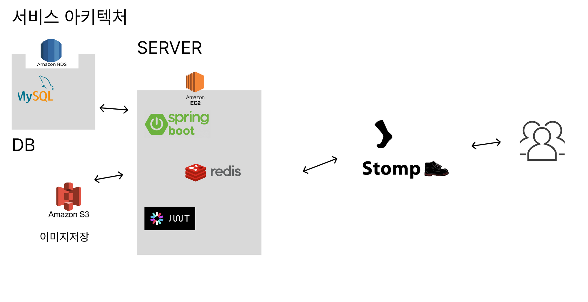
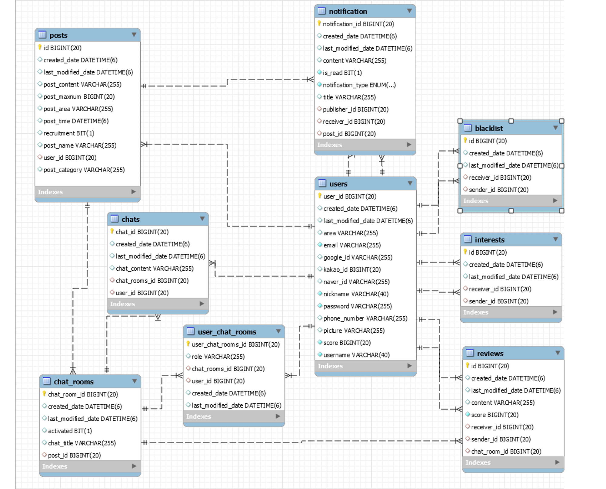

# 2023 Will-U Project

---------
> 👯‍♀️ 무엇이든 누군가와 함께 하고 싶을 때, 함께 할 친구를 찾을 수 있는 사이트

## 프로젝트 소개

-------
> 🔎 함께 할 인원 모집, 검색, 채팅을 통한 유저 연결 및 알림 제공 사이트

## ⚙ 개발환경

---

- `Java 8`
- `JDK 17.0.7`
- `MySQL Server 8.0`
- `JPA`

### 🛠 서비스 아키텍처

---

## ✨기능 소개

---

### 1. 사용자

- 회원 가입
- springSecurity 적용
- jwt토큰 (Cookie) 적용
- refreshToken 적용
- 로그인
    - 일반 (자체) 로그인
    - 카카오 로그인
    - 구글 로그인
    - 네이버 로그인
- 로그아웃
    - redis를 사용한 토큰 로그아웃
- 회원탈퇴
- 프로필 수정
    - S3를 사용한 프로필 이미지 업로드, 업데이트
    - 닉네임 수정

### 2. 관심 & 차단 유저

- 관심 유저
    - CRD
- 차단유저
    - CRD

### 3. 게시글 (모집글)

- 모집 글 작성
    - 제목
    - 내용
    - 약속 시간
    - 약속 장소
    - 최대 인원
    - 관심사
    - 채팅방 생성
- 모집글 조회 (페이징 적용)
    - 작성자 닉네임
    - 프로필 이미지
    - 활동 지역
    - 유저 점수
    - 모집 상태
    - 최대 참여인원
    - 현재 참여인원
    - 게시글 정보
- 모집 글 수정
- 모집 글 삭제
- 게시글 검색
    - 페이징 적용
    - 2글자 이상으로 제한
    - 검색 조건 : 제목(default), 내용, 글쓴이, 모집중인 것만(default=false)
- 모집 상태 변경

### 4. 채팅 기능

- 실시간 메세지 송/수신
    - STOMP를 사용한 소켓연결
    - STOMP의 주소, 구독 기능 으로 메세지 송/수신
    - SockJS를 이용한 여러 브라우저 호환
- 채팅방 데이터 저장
    - 소켓 연결시 STOMP를 이용한 구독 주소 테이블에 저장
    - 사용자가 채티방 접속시 해당 구독 데이터 사용
- 채팅방에 속한 사용자 저장
    - 소켓 연결시 사용자 정보 저장
    - 사용자가 초대된 시간 저장
    - 사용자가 속한 채팅방이 아니면 접속 불가
- 채팅방 조회
    - 사용자가 속한 채팅방만 조회
    - 채팅방이 활성화 되어있는 방만 조회
    -  비활성화 채팅방 접속 불가
- 채팅 저장
    - 채팅이 송신된 시간과 내용 저장
    - 사용자가 채팅방에 초대된 시간 과 비교 후 데이터 조회
- 채팅방 사용자 추가
    - 신청을 허락한 사용자의 데이터를 저장
- 사용자 강퇴
    - 채팅방 방장이 사용자 강퇴
- 채팅방 나가기

### 5. 알림 기능
- SSE 연결
  - 클라이언트에서 SSE 연결 요청을 통해 서버와 지속적인 연결을 하는 길을 만듭니다.
  - 연결 후 전송되는 알림이 없으면 503 에러가 발생하므로 연결하고 바로 더미데이터를 보내주도록 했습니다.
  - 재연결이 거의 발생할 일이 없지만 재연결이 발생하면 기존 클라이언트가 갖고있는 마지막으로 받았던 Event의 Id를 사용해 연결이 끊긴 동안 수신된 알림들을 수신합니다.  
- 읽음 처리
  - 알림의 닫기나 승인/거절 버튼을 누르면 알림을 읽음처리하여 내 읽지 않은 알림 목록에서 사라집니다.

- 알림 직접 보내기
  - EventListener를 통한 알림 전송이 아닌 NotificationService를 사용한 알림만을 보내는 API로
    독립적으로 알림 전송이 필요한 경우 사용됩니다.
  - 알림 타입에 따라 다른 알림이 생성되어 전송되도록 했습니다.
- API에 붙는 알림 보내기
    - 알림 서비스와 직접적으로 연결하는 걸 피하기 위해 EventListener를 사용했습니다.
      eventListener로 API에 필요한 알림을 만들어 전송할 수 있습니다.
- 로그인한 유저에 대한 읽지 않은 알림 목록 조회
  - 사용자는 본인이 확인하지 않은 동안에도 본인에게 온 알림을 저장하고 후에 확인할 수 있어야 한다고 생각했습니다.
  - 따라서 유저가 알림목록에서 유저에게 온 알림 중 읽지 않은 알림은 계속 조회가 되도록 했습니다.
 
  
### 추가 예정

- 게시글 상세페이지, 프로필 상세페이지, 채팅방
    - 본인과 다른 유저의 화면 다르게 보여주기
- 프로필
    - 후기 받기, 유저 점수 계산해서 보여주기
- 로그인 필요한 페이지 접근 시 로그인 페이지로 이동시키기
- 회원가입
    - 이메일 인증
    - 패턴 적용
- 차단 유저
    - 차단유저에게 내 게시글 보여주지 않기
    - 차단유저에게 내 프로필 보여주지 않기
- 모집완료된 글 수정 불가

- 시간 관련 기능
    - 만남 완료 시간이 지나면 '게시글' 모집 상태 변경, '채팅방' 비활성화
    - 만남 시간 후 ?일 동안 게시글 삭제를 하지 못하게 하여 후기를 작성할 시간을 남겨둔다.
    -

- 채팅방 모집 완료 시 채팅방 비활성화

## 📄ERD

---

## 👩‍👩‍👧‍👧팀원 및 역할

### 박정은

- 채팅 기능 구현
- 관심 기능
- 차단 기능
- 모집글 수정
- 모집글 조회

### 심형철

- 알림기능
- refresh Token
- 로그인
- 회원가입
- 유저 상세 조회
- 프로필 수정
- 로그아웃

### 이민우

- 후기 요구사항 정의
- 소셜로그인 (네이버, 카카오, 구글)
- 채팅 기능
- 로그인
- 회원가입
- 유저 상세 조회
- 프로필 수정

### 이상인

- 게시글 검색
- S3 이미지 업로드, 프로필 이미지 저장 및 조회
- 모집글 등록
- 모집들 삭제
- 모집글 조회
- 모집글 상태변경
- 모집글 페이징
- 모집한 게시글 조회
- 후기 요구사항 정의

---

## 🌎배포

http://43.201.154.114:8080

---

## 📆개발 일정

---
> 8월 17일 ~ 8월 22일

- 역할 분담, 계획 수립 및 프로젝트 생성
- 기본 (필수) 기능 구현

> 8월 23일 ~ 27일

- 세부사항 조정
- 채팅 기능 구현
- 알림 기능 구현

> 8월 28일 ~ 8월 30일

- 프론트엔드 1차 구현 (APi 작동 확인)
- 세부사항 조정
- 1차 배포

> 8월 30일 ~

- 프론트 엔드 2차 구현 (사용자 편의를 위한 조정)
- 세부사항 조정
- 2차 배포

> -------

마지막 수정 날짜 : 2023-09-03

